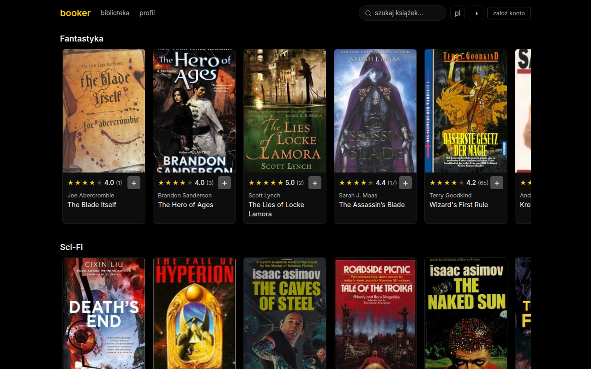
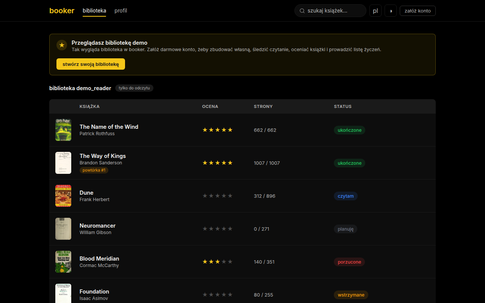
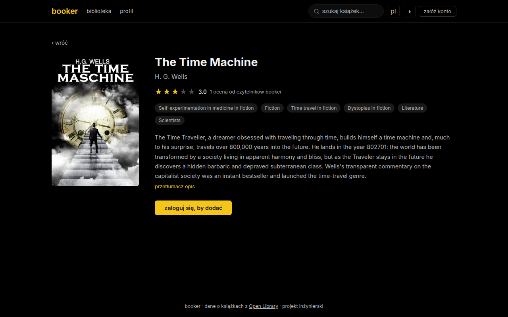

# booker

personal book‑tracking / reading‑list app, styled after MyAnimeList. python/fastapi backend + react frontend, book data from [open library](https://openlibrary.org).

thesis project.



<details>
<summary>more screenshots</summary>




</details>

## what it does

- browse genre feeds, live search, book pages with descriptions and covers
- personal library: statuses (reading / plan / completed / dropped / hold), page progress, rereads, private notes, custom books, filtering and sorting
- community ratings. the score on a card is the real average of what booker users rated that book, and if nobody here rated it yet, it falls back to open library's reader ratings. no fake numbers
- "picked for you" feed based on the subjects of books you already have
- profile stats: pages read, reading time, status breakdown, books finished per month (start/finish dates get tracked automatically), custom avatar and banner
- polish/english interface, plus on-demand description translation (mymemory)
- library export to csv/json, password change, account deletion, login rate limiting
- demo library for logged-out visitors, light/dark theme
- works on phones too: the library turns into cards on small screens, touch targets get bigger, no ios zoom jumps

## deployment

easiest way, docker builds the frontend by itself:

```sh
docker compose up -d --build    # http://localhost:8000
docker compose down
```

`--build` is only needed the first time and after code changes. day to day a plain `docker compose up -d` just starts the image you already have.

the db lands in a named volume, so it survives rebuilds. for anything public set your own `BOOKER_SECRET_KEY`: copy `.env.example` to `.env` (or just drop the `.example` from the name), put a random value in it and docker compose picks it up on its own. running locally for yourself? skip it, there's a default.

on windows: install [docker desktop](https://www.docker.com/products/docker-desktop/) first (it sets up wsl2 for you), then open a regular cmd, `cd` into the project folder and run the same `docker compose up -d --build`. when windows firewall asks for permission, click allow, and make sure your wi-fi is set to "private" if you want to open the app from your phone. no python or node needed for this route.

without docker it's two steps, build the frontend and run the production server (it serves the built files plus the api under `/api`):

```sh
cd frontend && npm run build
cd ../backend && uvicorn main:server --host 0.0.0.0 --port 8000
```

## development

backend:

```sh
cd backend
python -m venv .venv && source .venv/bin/activate
pip install -r requirements.txt
uvicorn main:app --reload
```

frontend:

```sh
cd frontend
npm install
npm run dev     # http://localhost:5173
```

the vite dev server proxies `/api` to the backend, so both need to be running. api docs (swagger) are at http://127.0.0.1:8000/docs.

env (optional): `BOOKER_SECRET_KEY` for jwt signing, `BOOKER_DATABASE_URL` to move the sqlite file, `VITE_API_BASE` if the api lives somewhere else.

## tests

```sh
cd backend && pip install -r requirements-dev.txt && python -m pytest tests/
cd frontend && npm test
```
